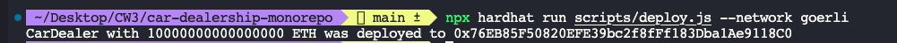

<div align="center" style="margin-bottom:10px; margin:auto" >
  
</div>

<h2 align="center" style="margin:50px">
   Decentralized Auction
</h2>

<hr/>

<br/>

<div align="center">

  <a href="#-about-this-project">About this project</a>&nbsp;&nbsp;-&nbsp;
  <a href="#-caveats">Caveats</a>&nbsp;&nbsp;-&nbsp;
  <a href="#-roadmap">Roadmap</a>&nbsp;&nbsp;-&nbsp;
  <a href="#-running-the-project">Running the project</a>

</div>

<br/>

# 💡 About this project

>This project was build as part of the CW3 program.

This is the front-end from project 3 **Decentralized Auction** developed in the [Solidity](https://cw31.teachable.com/courses/enrolled/1853732) from CW3.

Which integrates the website with the Smart Contract and allow the user to go through the entire cycle to buy and sell a car using the Blockchain and Web3.

This project was built using [**React**](https://reactjs.org/)

And uses [ether.js](https://etherjs.org) to integrate the front end with the Smart Contract.

<br/>

# 🔥 Caveats

- As a good practice we are not hardcoding the contract address in the code, to run the project and connect properly with the deployed smart contract address you must use the React env variables.
Follow the below documentation for more information: 

[Adding Temporary Environment Variables In Your Shell](https://create-react-app.dev/docs/adding-custom-environment-variables/#adding-temporary-environment-variables-in-your-shell)

- And remember to add the abi.json generated after you deploy your Smart contract within `utils/CarDealer.json` file.

<br/>

## 🗺 Roadmap

[ ] Treat an show up errors to the user.

[ ] Improve the layout.  

<br/>

## 🏁 Running the project

1 - To run at the first time the project will be necessary creating a folder

```bash
mkdir <folder-name>
```

2 - Now within the folder

```bash
cd <folder-name>
```

3 - Let's cloning the repository

```bash
git clone https://github.com/CompleteWeb3/project-1
```

4 - Execute the following command to create `node_modules` folder

```bash
npm i
```

5 - Create your `.env` file with those settings:

```bash
API_URL="INFURA_KEY_URL"
PRIVATE_KEY="SMART_WALLET_PRIVATE_KEY"
```

6 - to deploy the Smart Contract run the following command:

```bash
npx hardhat run scripts/deploy.js --network goerli
```
> You will get the following output, copy your contract address from there:

<div align="center" style="margin-bottom:10px; margin:auto" >
  
</div>

7 - to run the tests:

```bash
npx hardhat test
```


8 - to run on your browser

```bash
REACT_APP_CONTRACT_ADDRESS=<your contract address> npm start
```

<br/>


<h4 align="center">
😃  <strong>BE HAPPY!</strong>
</h4>

<h4 align="center">
  "Stay hungry stay foolish!"
</h4>

<br/>

<hr/>

<br/>

<h3 align="center">
Author: <a alt="Fred-Reis" href="https://github.com/Fred-Reis">Frederico Reis</a>
</h3>

<p align="center">

  <a alt="Frederico Reis" href="https://www.linkedin.com/in/frederico-reis-dev/">
    </a>
  <a alt="Frederico Reis" href="https://github.com/Fred-Reis ">
  </a>

</p>

<p align="center">Made with ♥️ 2022</p>
